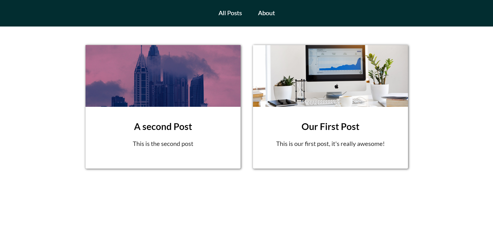
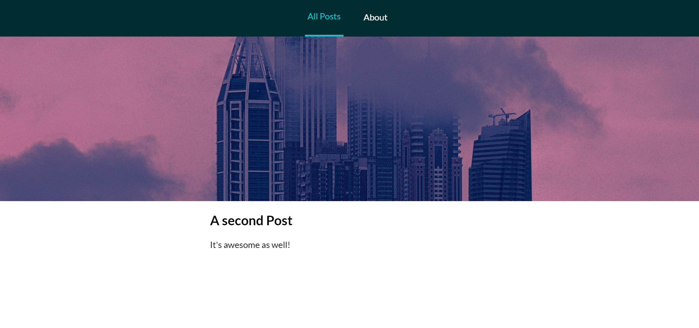

# story-blog

> Awesome blog

## Build Setup

``` bash
# install dependencies
$ npm run install

# serve with hot reload at localhost:3000
$ npm run dev

# build for production and launch server
$ npm run build
$ npm run start

# generate static project
$ npm run generate
```

For detailed explanation on how things work, check out [Nuxt.js docs](https://nuxtjs.org).

## Tech Stack & Features

- Blog built with Vue.js and nuxt.js
- [Storyblok](https://www.storyblok.com/) — CMS with visual editor
- Responsive Design
- Components and Pages

## Final Effect Screenshot



